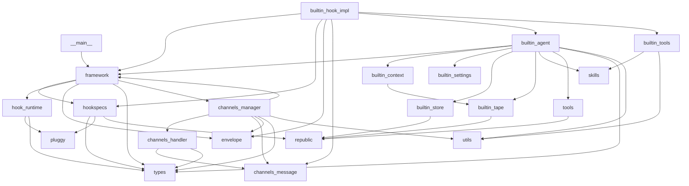

# Bub 模块依赖关系图

> 日期：2026-03-09（UTC+8）

## 1. 模块依赖关系（按文件）

### 1.1 入口层

```
src/bub/__main__.py
  ├─ src/bub/framework.py
  └─ typer
```

### 1.2 框架层

```
src/bub/framework.py
  ├─ src/bub/envelope.py
  ├─ src/bub/hook_runtime.py
  ├─ src/bub/hookspecs.py
  ├─ src/bub/types.py
  ├─ pluggy
  ├─ typer
  ├─ loguru
  ├─ republic
  └─ src/bub/channels/base.py (TYPE_CHECKING)
```

### 1.3 Hook 层

```
src/bub/hookspecs.py
  ├─ pluggy
  ├─ republic
  └─ src/bub/types.py

src/bub/hook_runtime.py
  ├─ pluggy
  ├─ loguru
  └─ src/bub/types.py
```

### 1.4 内建实现层

```
src/bub/builtin/hook_impl.py
  ├─ src/bub/framework.py
  ├─ src/bub/hookspecs.py
  ├─ src/bub/envelope.py
  ├─ src/bub/channels/message.py
  ├─ src/bub/channels/base.py
  ├─ src/bub/channels/cli/__init__.py
  ├─ src/bub/channels/telegram.py
  ├─ src/bub/builtin/agent.py
  ├─ src/bub/builtin/tools.py
  ├─ typer
  ├─ loguru
  └─ republic.tape.TapeStore
```

### 1.5 Agent 层

```
src/bub/builtin/agent.py
  ├─ src/bub/framework.py
  ├─ src/bub/builtin/context.py
  ├─ src/bub/builtin/settings.py
  ├─ src/bub/builtin/store.py
  ├─ src/bub/builtin/tape.py
  ├─ src/bub/skills.py
  ├─ src/bub/tools.py
  ├─ src/bub/types.py
  ├─ src/bub/utils.py
  ├─ republic
  └─ asyncio
```

### 1.6 工具层

```
src/bub/tools.py
  ├─ republic
  ├─ loguru
  └─ pydantic

src/bub/builtin/tools.py
  ├─ src/bub/skills.py
  ├─ src/bub/utils.py
  ├─ src/bub/builtin/agent.py (TYPE_CHECKING)
  ├─ asyncio
  └─ pathlib
```

### 1.7 技能层

```
src/bub/skills.py
  ├─ pathlib
  ├─ yaml
  └─ warnings
```

### 1.8 通道层

```
src/bub/channels/manager.py
  ├─ src/bub/framework.py
  ├─ src/bub/channels/base.py
  ├─ src/bub/channels/handler.py
  ├─ src/bub/channels/message.py
  ├─ src/bub/envelope.py
  ├─ src/bub/types.py
  ├─ src/bub/utils.py
  ├─ loguru
  ├─ pydantic_settings
  └─ asyncio

src/bub/channels/handler.py
  ├─ src/bub/channels/message.py
  ├─ src/bub/types.py
  ├─ loguru
  └─ asyncio

src/bub/channels/message.py
  └─ contextlib
```

### 1.9 状态与上下文层

```
src/bub/builtin/context.py
  ├─ republic
  └─ src/bub/builtin/tape.py

src/bub/builtin/store.py
  ├─ republic
  ├─ loguru
  └─ asyncio

src/bub/builtin/tape.py
  ├─ republic
  ├─ rapidfuzz
  └─ pydantic

src/bub/builtin/settings.py
  ├─ pydantic
  └─ pathlib
```

---

## 2. 依赖关系图（Mermaid）



---

## 3. 关键依赖说明

### 3.1 外部依赖

| 依赖 | 用途 |
|------|------|
| `pluggy` | Hook 系统（插件管理） |
| `typer` | CLI 框架 |
| `loguru` | 日志 |
| `republic` | Tape 上下文、LLM、工具调用 |
| `pydantic` | 配置验证 |
| `pydantic_settings` | 环境变量配置 |
| `rapidfuzz` | Tape 搜索模糊匹配 |
| `yaml` | 技能 frontmatter 解析 |

### 3.2 内部依赖

| 模块 | 被谁依赖 |
|------|----------|
| `framework.py` | `__main__.py`、`builtin/hook_impl.py`、`builtin/agent.py`、`channels/manager.py` |
| `hookspecs.py` | `framework.py`、`builtin/hook_impl.py` |
| `hook_runtime.py` | `framework.py` |
| `envelope.py` | `framework.py`、`builtin/hook_impl.py`、`channels/manager.py` |
| `types.py` | `framework.py`、`hookspecs.py`、`hook_runtime.py`、`builtin/hook_impl.py`、`builtin/agent.py`、`channels/manager.py`、`channels/handler.py` |
| `skills.py` | `builtin/agent.py` |
| `tools.py` | `builtin/agent.py` |
| `channels/message.py` | `builtin/hook_impl.py`、`channels/manager.py`、`channels/handler.py` |
| `channels/manager.py` | `builtin/cli.py`、`builtin/hook_impl.py` |

---

## 4. 循环依赖检查

### 4.1 无循环依赖

Bub 项目采用分层设计，依赖方向清晰：

- 入口层 → 框架层 → Hook 层 → 内建实现层 → 工具/技能层
- 通道层独立，通过 `provide_channels` hook 与框架交互

### 4.2 特殊依赖

- `builtin/hook_impl.py` 依赖 `framework.py`（用于调用 `dispatch_via_router`）
- `builtin/agent.py` 依赖 `framework.py`（用于获取 tape store、system prompt）

这两个依赖是合理的，因为内建实现需要访问框架能力。

---

## 5. 依赖关系总结

1. **入口层**：`__main__.py` 依赖 `framework.py`
2. **框架层**：`framework.py` 依赖 hook 系统、通道、envelope、types
3. **Hook 层**：`hookspecs.py`、`hook_runtime.py` 依赖 pluggy
4. **内建实现**：`builtin/hook_impl.py` 依赖框架、hookspecs、通道、agent
5. **Agent**：`builtin/agent.py` 依赖框架、tape、skills、tools
6. **工具/技能**：`tools.py`、`skills.py` 依赖 republic、pydantic
7. **通道**：`channels/manager.py` 依赖框架、handler、message
8. **状态/上下文**：`builtin/store.py`、`builtin/tape.py` 依赖 republic

整体依赖关系清晰，无循环依赖，符合分层设计原则。
